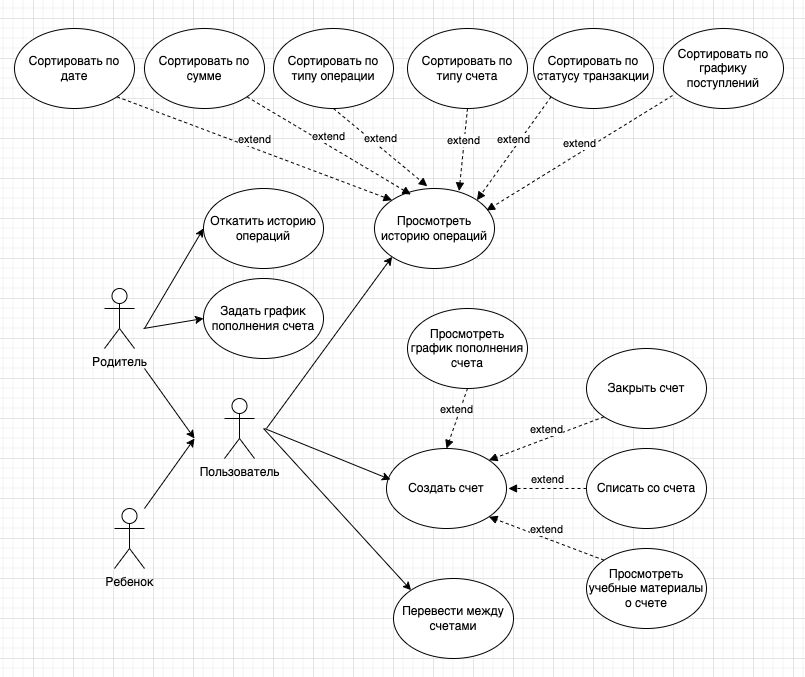
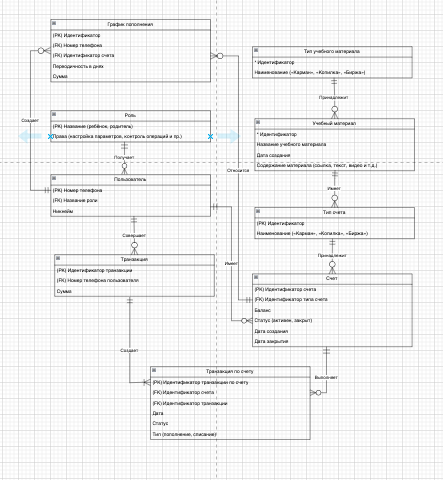

# Catch Coin App

## 1 Введение

### 1.1 Цель проекта

Настоящий документ описывает функциональные и нефункциональные требования к приложению Catch Coin. Приложение предназначено для выдачи карманных денег детям под контролем родителей и обучения детей основам финансовой грамотности. Система имитирует работу небольшого «игрушечного банка», функционирующего по правилам и нормам настоящего банковского учреждения. В данной системе взрослые выступают в роли наставников и контролёров денежного потока, а дети – в роли клиентов банка

Приложение позволяет ребенку:

- Отслеживать баланс «карманных денег»;
- Изучать историю движения средств (пополнения, снятия, переводы между «карманом», «копилкой» и «биржей»);
- Ставить финансовые цели и использовать инструменты-помощники для их достижения;
- Работать с реальными финансовыми инструментами (различные виды депозитов, покупка/продажа ценных бумаг);
- Получать информацию о финансовых инструментах;
- Изучать данные о затратах взрослых на обязательные платежи, напрямую связанные с ребенком (например, покупка одежды, канцелярии, посещение врача, покупка медикаментов, оплата сотовой связи и прочие расходы, попадающие под категорию «субсидируемые взрослыми»)

При этом взрослые могут:

- Устанавливать ограничения на траты;
- Предоставлять субсидии на определённые расходы (например, оплата телефона или обучения);
- Инвестировать в достижения ребенка, выдавая гранты на проведение исследований (например, «Математический анализ накоплений и магии сложных процентов» или «Бюджетирование и планирование расходов»);
- Определять порядок и сроки поступления «карманных денег» и их обналичивания.

### 1.2 Задачи проекта

- Регламентировать процесс выдачи карманных денег ребенку;
- Научить детей планировать бюджет, копить на цели и понимать ценность денег в безопасной среде под надзором взрослых;
- Познакомить детей с основными финансовыми инструментами и принципами работы банковской системы.

### 1.3 Границы проекта

Проект Catch Coin охватывает разработку веб- и мобильного приложения для управления карманными деньгами детей. В рамках проекта реализуются разные функциональные возможности.

Границы проекта с позиции ребенка:

<b>Просмотр финансовой информации:</b>

- Просмотр баланса «карманных денег»;
- Просмотр истории операций: поступлений, списаний, переводов между счетами («карман», «копилка», «биржа»);
- Применение различных фильтров (по дате, по сумме, по типу операции) для удобства просмотра;
- Просмотр графика регулярных начислений карманных денег (расписание поступлений).

<b>Работа с финансовыми инструментами:</b>

- Просмотр списка виртуальных банков и предложений по «копилкам» (депозитам);
- Выбор «копилки» и изучение информации о различных видах депозитов, их условиях и особенностях;
- Возможность закрытия «копилки» (депозита) по достижении цели или по истечении срока;
- Просмотр инвестиционных идей на виртуальной бирже от «вымышленных экспертов»;
- Выбор биржевых инструментов (облигации, акции);
- Создание заявок на покупку и продажу виртуальных ценных бумаг (имитация работы биржи);
- Просмотр «биржевого стакана», графиков купонных выплат и выплаты дивидендов;
- Просмотр деталей своего финансового портфеля.

<b>Планирование и обучение:</b>

- Постановка финансовых целей (накопить на игрушку, обучение и т.д.);
- Использование интерактивного калькулятора-планировщика для достижения целей;
- Доступ к обучающим материалам: ссылки на видео, статьи, квизы и мини-игры по финансовой грамотности;
- Создание заявки на грант (проект или исследование, например, «Математический анализ накоплений и магии сложных процентов»).

Границы проекта с позиции ребенка:

<b>Контроль и аналитика:</b>

- Просмотр детализированной истории операций ребёнка (все транзакции, лимиты, уведомления);
- Получение отчетов и аналитики по финансовой активности (графики, статистика, динамика выполнения финансовых целей).

<b>Управление денежным потоком:</b>

- Настройка графика начислений карманных денег: определение сумм, периодичности и условий обналичивания;
- Установка и изменение лимитов расходов по категориям;
- Управление субсидиями: просмотр, редактирование и установка параметров субсидированных расходов (например, оплата телефона, обучение).

<b>Работа с заявками на гранты:</b>

- Просмотр заявок на грант, поданных ребёнком, с детальным описанием проекта;
- Принятие или отклонение заявки на грант;
- Определение и корректировка суммы гранта, а также установка условий по использованию выделенных средств.

<b>Настройка и уведомления:</b>

- Управление настройками уведомлений (оповещения о превышении лимитов, поступлении средств, изменениях в финансовой активности);
- Управление профилем ребёнка (просмотр, редактирование, контроль доступа к функционалу).

Границы проекта с позиции системы:

<b>Финансовые расчёты и автоматизация:</b>

- Автоматический расчёт начислений карманных денег согласно установленному графику и лимитам;
- Расчёт процентов по виртуальным депозитам с учётом механизма сложных процентов;
- Вычет комиссии биржи при операциях с виртуальными ценными бумагами.

<b>Обработка транзакций:</b>

- Обеспечение целостности и согласованности данных при проведении операций (пополнение, снятие, переводы, инвестиционные сделки);
- Реализация механизмов резервного копирования, логирования и мониторинга транзакций для аудита и восстановления данных.

<b>Интеграция и безопасность:</b>

- Интеграция с внешними API для получения актуальной информации о финансовых инструментах (например, данные о курсах, новостях финансовых рынков);
- Обеспечение защиты персональных данных с применением современных методов шифрования и аутентификации;
- Реализация системы уведомлений (push, email) о важных событиях (выдача гранта, превышение лимитов, изменения баланса).

<b>Отчетность и аналитика:</b>

- Формирование отчетов по активности пользователей, эффективности использования финансовых инструментов и выполнению финансовых целей;
- Ведение статистики по всем транзакциям для последующего анализа и оптимизации работы системы.

## 2 Общее описание

### 2.1 Перспективы проекта

Catch Coin – это современное мобильное приложение, позволяющее взрослым (родителям или другим членам семьи) контролировать выдачу карманных денег детям, отслеживать и анализировать их финансовую активность, а также обучать детей основам финансовой грамотности в безопасной и игровой форме

### 2.2 Классы пользователей и их характеристики

<b>Взрослый (целевой клиент приложения)</b>

- Основной пользователь, принимающий решения;
- Имеет различные роли и права ими определенные;
- В роли «Родитель» - расширенные права по настройке параметров приложения, контроля операций и аналитике;
- В роли «Родитель» - получает уведомления, отчёты и рекомендации по управлению финансовой активностью ребенка;
- Для всех остальных взрослых права определяются взрослым в роли «Родитель».

<b>Ребенок (активный пользователь приложения)</b>

- Активный пользователь, выполняющий операции по просмотру баланса, истории транзакций, постановке целей и обучению финансовой грамотности;
- Действия ребенка проходят под контролем и с разрешения взрослого в роли «Родитель» или взрослого имеющего права для выдачи разрешений.

### 2.3 Классы счетов и их характеристики

<b>Карман</b>

- Основной счет для ежедневных операций с карманными деньгами;
- Баланс, история операций (пополнения, снятия, переводы);
- Функционал перевода средств между счетами.

<b>Копилка</b>

- Счет для накоплений, оформляемый в виде депозитного продукта;
- Баланс, условия вклада (процентная ставка, срок, возможность начисления сложных процентов);
- Возможность закрытия при достижении цели или по истечении срока;
- Связан с основным счетом.

<b>Биржа</b>

- Виртуальный инвестиционный счет для работы с ценными бумагами;
- Баланс, история операций, отображение «биржевого стакана», графиков выплат по купонам и дивидендам;
- Возможность создания заявок на покупку/продажу виртуальных ценных бумаг;
- Связан с основным счетом.

### 2.4 Классы заявок и их характеристики

<b>Заявка на биржевую операцию</b>

- Создание заявки на покупку или продажу виртуальных ценных бумаг;
- Тип заявки (покупка/продажа);
- Инструмент, количество, цена;
- Статус заявки и временные метки.

<b>Заявка на грант</b>

- Запрос на финансирование исследовательского или проектного мероприятия от ребёнка;
- Название и описание проекта;
- Запрашиваемая сумма, условия использования средств;
- Статус (подана, принята, отклонена) и комментарии по принятию/отклонению со стороны взрослого.

### 2.5 Классы других сущностей и их характеристики

<b>Транзакция</b>

- Фиксация всех финансовых операций в системе;
- Наличие уникального идентификатора;
- Предоставление даты и времени проведения операции;
- Знание о сумме и типе операции (пополнение, снятие, перевод, инвестиционная сделка);
- Информация об исходном и целевом счетах (для переводов);
- Статус операции и, при необходимости, комментарии или примечания.

<b>Финансовая цель</b>

- Планирование накоплений на конкретные задачи (например, покупка игрушки, обучение);
- Имеет точное и понятное название и описание цели;
- Есть целевая сумма и текущий прогресс накоплений;
- Сроки достижения цели и статус выполнения.

<b>Депозит</b>

- Финансовый инструмент для накоплений с начислением процентов;
- Тип депозита и условия вклада (процентная ставка, срок вклада);
- Механизм начисления сложных процентов;
- Текущий статус (активен/закрыт).

<b>Биржевой инструмент (Ценная бумага)</b>

Виртуальные инвестиционные продукты, доступные через биржевой модуль приложения;
Тип инструмента (акция, облигация);
Текущая цена, динамика изменения стоимости;
Дивидендная информация, объем торгов и особенности инструмента.

<b>Портфель</b>

- Отображение совокупности инвестиций ребёнка через модуль биржи;
- Список принадлежащих ценных бумаг и их количественные показатели;
- Текущая стоимость активов, динамика изменения портфеля;
- Информация о дивидендах и купонных выплатах.

<b>Лимит</b>

- Контроль и ограничение трат ребёнка по различным категориям;
- Категория расходов (например, связь, одежда, обучение);
- Максимальная допустимая сумма на определённый период;
- Правила срабатывания уведомлений при превышении лимита.

<b>Субсидии</b>

- Финансовая поддержка, предоставляемая взрослыми для покрытия определённых расходов ребёнка;
- Категория расходов, к которой относится субсидия;
- Размер субсидии и период её действия;
- Условия предоставления и использования субсидированных средств.

<b>Расписание начислений</b>

- Определение графика поступления карманных денег;
- Периодичность начислений (ежедневно, еженедельно, ежемесячно);
- Фиксированная или переменная сумма начисления;
- Условия обналичивания и временные рамки.

<b>Уведомления</b>

- Оповещения пользователей о важных событиях в системе;
- Тип уведомления (превышение лимита, поступление средств, изменение настроек, решение по заявке на грант);
- Статус уведомления (прочитано/не прочитано);
- Временные метки и дополнительные данные для контекста события.

<b>Лог транзакций</b>

- Обеспечение безопасности и прозрачности проведения операций;
- Уникальный идентификатор записи аудита;
- Подробное описание операции, включая идентификаторы участников и временные метки;
- Информация, необходимая для восстановления данных или проведения анализа работы системы.

### 2.5 Обзорная картина доменной области

В совокупности данные сущности образуют основу для функционирования приложения Catch Coin. Пользователи (взрослые и дети) взаимодействуют с различными финансовыми счетами, проводя транзакции и реализуя финансовые цели. 

Виртуальные финансовые инструменты (депозиты, ценные бумаги) и связанные с ними заявки (на операции или гранты) позволяют не только моделировать реальные банковские процессы, но и обучать детей финансовой грамотности в игровой и контролируемой форме. 

Дополнительные элементы (лимиты, субсидии, расписание начислений, уведомления и логирование) обеспечивают безопасность, контроль и аналитику, необходимые для полноценного управления финансовым потоком.

### 2.6 Ограничения и предположения

- Приложение должно работать на современных мобильных устройствах с ОС iOS и Android (с приоритетом на индивидуальном использование);
- Приложение должно работать на современных планшетах IOS и Android (c приоритетом на совместное использование при изучении интерактивных данных);
- Приложение должно работать на настольных компьютерах (с приоритетом на администрирование и изучение обучающих материалов).

## 3 Функции системы

### 3.1 Работа со счетом

### 3.1.1 Работа со счетом. Описание

Авторизованный пользователь Catch Coin, взаимодействующий с приложением имеет возможность создать один из трех виртуальных счетов

- Карманные деньги;
- Копилка;
- Биржевой счет.

Созданный счет имеет следующую функциональность:

<b>Просмотр истории операций (транзакций):</b>

- Возможность просмотра истории операций, включающей поступления, снятия средств и переводы между счетами. 
- Пользователь может сортировать данные по дате, сумме, типу операции, а также по исходному и целевому счетам и текущему статусу транзакций.                                                                   
- Пользователь в роли «Родитель» может удалить одну или несколько операций из истории

<b>Закрыть счет:</b>

- Пользователь может закрыть свой счет, что приведет к блокировке всех дальнейших действий с ним

<b>Перевести между счетами:</b>

- Пользователь может перевести средства со счета на счет. Между тремя виртуальными счетами

<b>Списать со счета:</b>

- Пользователь может списать средства со счета. Списание произойдет через время

<b>Просмотреть учебные материалы по счету:</b>

- Пользователь может изучить специальные материалы

<b>Просмотреть план пополнения счета:</b>

- Пользователь может изучить план регулярных начислений средств на счет, что позволяет планировать бюджет и контролировать поступления в наглядном виде.

Для пользователя в роли «Родитель» становится доступен дополнительный функционал работы со счетами

<b>Откатить историю операций:</b>

- Пользователь может выбрать одну из операций к которой будет произведен откат. Так как каждая операция в системе имеет характеристику времени, система удалит все записи, связанные со счетом, которые были созданы позже чем запись, к которой происходит откат

### 3.1.2 Работа со счетом. Use case

| Уникальный код и название | ВИ-1: Создать счет |
|----------------|----------|
| Контекст использования | Пользователь (ребёнок или взрослый) создаёт новый виртуальный счёт для управления карманными деньгами |
| Область действия | Веб- и мобильное приложение Catch Coin |
| Основное действующее лицо | Ребёнок, Взрослый (родитель) |
| Предусловие | Пользователь успешно авторизован в приложении |
| Минимальные гарантии успеха | Система уведомляет пользователя о причине невозможности создания счета |
| Гарантии успеха | Новый счёт успешно создан, его параметры и начальный баланс сохранены в системе с предопределенными системой значениями |
| Триггер | Пользователь выбирает опцию создания нового счёта |
| Базовый сценарий | Создать счет |
| 1 | Пользователь авторизуется в приложении |
| 2 | Пользователь выбирает действие «Создать счёт» |
| 3 | Система предлагает выбрать тип нового счёта («Карманные деньги», «Копилка», «Биржевой счёт») |
| 4 | Пользователь выбирает тип создаваемого счёта |
| 5 | Система отображает параметры нового счёта и предлагает подтвердить создание |
| 6 | Пользователь подтверждает создание счёта |
| 7 | Система регистрирует счёт и уведомляет пользователя об успешном создании счёта |
| Расширение | Счёт уже существует |
| 3а | Система информирует пользователя, что счёт выбранного типа уже создан |
| 3а1 | Система предлагает перейти к существующему счёту |

| Уникальный код и название | ВИ-2: Закрыть счёт |
|----------------|----------|
| Контекст использования | Пользователь принимает решение закрыть виртуальный счёт (например, депозит «Копилка») |
| Область действия | Веб- и мобильное приложение Catch Coin |
| Основное действующее лицо | Ребёнок, Взрослый (родитель) |
| Предусловие | Счёт открыт и находится в активном состоянии |
| Минимальные гарантии успеха | Система предупреждает о невозможности закрыть счёт, если есть незавершённые транзакции |
| Гарантии успеха | Счёт закрыт, средства переведены на счет «Карманные деньги», счёт становится недоступным для дальнейших операций. |
| Триггер | Пользователь выбирает опцию «Закрыть счет» |
| Базовый сценарий | Закрыть счет |
| 1 | Пользователь выбирает счёт для закрытия |
| 2 | Система проверяет условия закрытия счёта |
| 3 | Пользователь подтверждает закрытие счёта |
| 4 | Система закрывает счёт и переводит средства обратно на основной счёт «Карманные деньги» |
| 5 | Система уведомляет пользователя об успешном закрытии счёта |

| Уникальный код и название | ВИ-3: Перевести между счетами |
|----------------|----------|
| Контекст использования | Пользователь (ребёнок или взрослый) осуществляет денежную транзакцию между виртуальными счетам |
| Область действия | Веб- и мобильное приложение Catch Coin |
| Основное действующее лицо | Ребёнок, Взрослый (родитель) |
| Предусловие | На балансе исходного счёта достаточно денежных средств для перевода |
| Минимальные гарантии успеха | Система информирует пользователя в случае недостаточности средств |
| Гарантии успеха | Средства успешно переведены, история транзакций обновлена |
| Триггер | Пользователь выбирает действие перевода средств между счетами |
| Базовый сценарий | Перевести между счетами |
| 1 | Пользователь выбирает исходный и целевой счета |
| 2 | Пользователь вводит сумму для перевода |
| 3 | Система проверяет возможность перевода |
| 4 | Средства переводятся на выбранный счёт |
| 5 | Система фиксирует транзакцию и уведомляет пользователя |

| Уникальный код и название | ВИ-4: Списать со счёта |
|----------------|----------|
| Контекст использования | Пользователь (ребёнок или взрослый) списывает средства с виртуального счёта |
| Область действия | Веб- и мобильное приложение Catch Coin |
| Основное действующее лицо | Ребёнок, Взрослый (родитель) |
| Предусловие | Счёт активен, и на нём достаточно средств |
| Минимальные гарантии успеха | Если учебные материалы недоступны, система сообщает об этом |
| Гарантии успеха | Средства успешно списаны, транзакция зафиксирована |
| Триггер | Пользователь выбирает действие «Списать со счёта». |
| Базовый сценарий | Списать со счета |
| 1 | Пользователь выбирает счёт |
| 2 | Пользователь вводит сумму списания |
| 3 | Система проверяет баланс |
| 4 | Средства списываются, баланс счёта обновляется |
| 5 | Система регистрирует транзакцию и уведомляет пользователя |

| Уникальный код и название | ВИ-5: Просмотреть учебные материалы о счёте |
|----------------|----------|
| Контекст использования | Пользователь (ребёнок или взрослый) создаёт новый виртуальный счёт для управления карманными деньгами |
| Область действия | Веб- и мобильное приложение Catch Coin |
| Основное действующее лицо | Ребёнок, Взрослый (родитель) |
| Предусловие | Материалы доступны в приложении |
| Минимальные гарантии успеха | Система уведомляет пользователя о причине невозможности создания счета |
| Гарантии успеха | Пользователь успешно просмотрел учебные материалы |
| Триггер | Пользователь выбирает действие «Учебные материалы» |
| Базовый сценарий | Просмотреть учебные материалы о счете |
| 1 | Пользователь выбирает счёт и переходит в раздел материалов |
| 2 | Система отображает список доступных материалов |
| 3 | Пользователь выбирает материал для просмотра |
| 4 | Система показывает материал |

| Уникальный код и название | ВИ-6: Просмотреть историю операций |
|----------------|----------|
| Контекст использования | Пользователь (ребёнок или взрослый) хочет просмотреть список всех операций со счетами (поступления, списания, переводы) |
| Область действия | Веб- и мобильное приложение Catch Coin |
| Основное действующее лицо | Ребёнок, Взрослый (родитель) |
| Предусловие | Пользователь авторизован, счёт создан и имеет хотя бы одну операцию |
| Минимальные гарантии успеха | При отсутствии истории операций система уведомляет пользователя об этом |
| Гарантии успеха | История операций отображена пользователю корректно и полностью |
| Триггер | Пользователь выбирает раздел «История операций» |
| Базовый сценарий | Просмотреть историю операций |
| 1 | Пользователь переходит в раздел истории операций |
| 2 | Система отображает список всех транзакций по счетам пользователя с базовой информацией (дата, сумма, тип операции, статус) |
| 3 | Пользователь просматривает список транзакций и завершает операцию |

| Уникальный код и название | ВИ-7: Сортировка истории операций |
|----------------|----------|
| Контекст использования | Пользователь сортирует отображаемую историю операций для удобства анализа и просмотра |
| Область действия | Веб- и мобильное приложение Catch Coin. Раздел «История операций» |
| Основное действующее лицо | Ребёнок, Взрослый (родитель) |
| Предусловие | Пользователь успешно открыл раздел «История операций» |
| Минимальные гарантии успеха | При невозможности сортировки система уведомляет об этом пользователя |
| Гарантии успеха | Операции отсортированы согласно выбранному критерию |
| Триггер | Пользователь выбирает критерий сортировки |
| Базовый сценарий | Сортировка истории операций |
| 1 | Пользователь просматривает историю операций |
| 2 | Пользователь выбирает критерий сортировки: - по дате - по сумме - по типу операции - по типу счёта - по статусу транзакции - по цикличности |
| 3 | Система сортирует историю согласно выбранному критерию |
| 4 | Пользователь просматривает отсортированную историю операций |

| Уникальный код и название | ВИ-8: Откатить историю операций |
|----------------|----------|
| Контекст использования | Родитель хочет отменить выполненные транзакции ребёнка (например, ошибочный перевод) |
| Область действия | Веб- и мобильное приложение Catch Coin |
| Основное действующее лицо | Взрослый (родитель) |
| Предусловие | В системе есть операции, которые могут быть отменены |
| Минимальные гарантии успеха | Система информирует, если система не может выполнить требуемое действие |
| Гарантии успеха | Транзакция успешно отменена, данные возвращены в исходное состояние |
| Триггер | Родитель выбирает функцию «Откатить историю операций» |
| Базовый сценарий | Откатить историю операций |
| 1 | Родитель выбирает историю операций ребёнка |
| 2 | Родитель выбирает операцию до которой требуется откатить историю операций |
| 3 | Система проверяет возможность отката (по времени, правилам и статусам операций) |
| 4 | Система отменяет все требуемые операции и обновляет баланс счётов |
| 5 | Родитель получает уведомление об успешном откате |
| Расширение | Невозможно откатить операцию |
| 3а | Система сообщает причину невозможности отката (например, истёк допустимый период для отката) |
| 3а1 | Система предлагает создать автоматическую заявку в службу поддержки для решения пользовательской задачи |

### 3.1.3 Работа со счетом. Логическая модель данных

